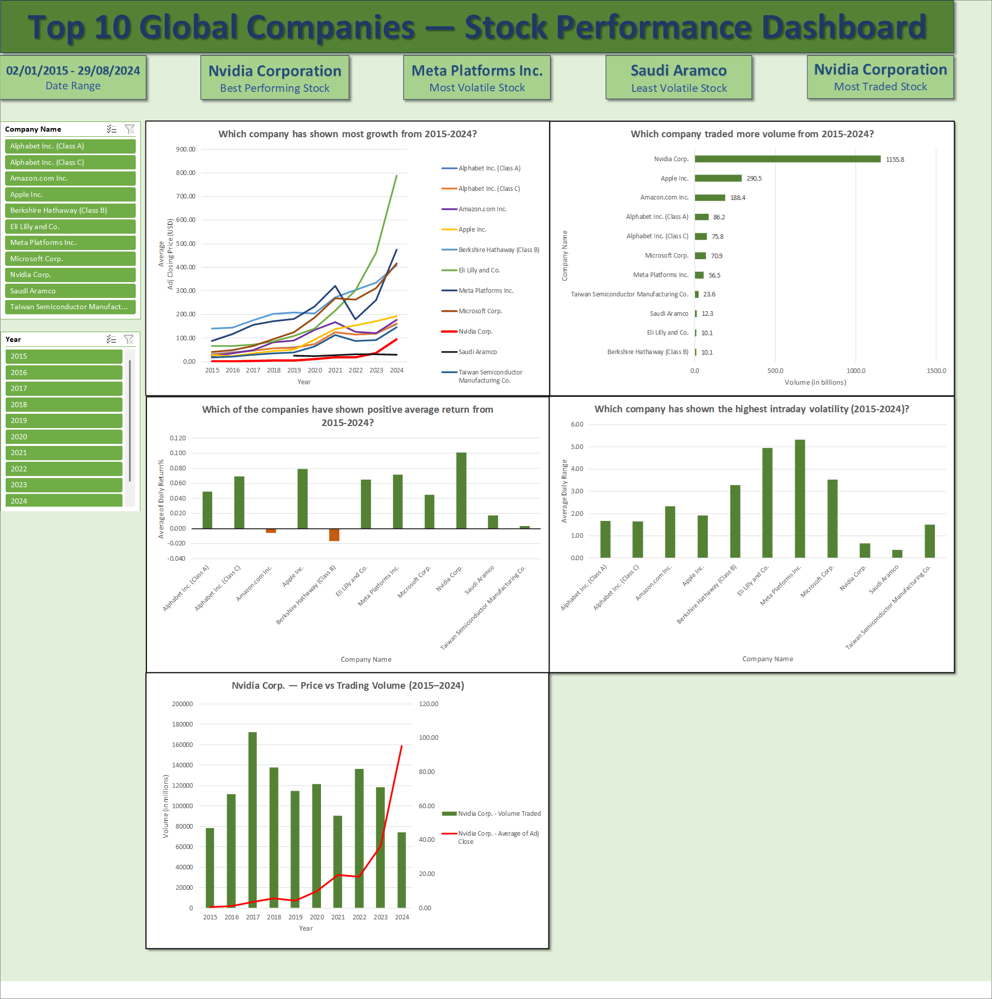

# Top 10 Global Companies — Stock Market Analysis using MS-Excel

## Objective
Analysed 10 years of daily stock market data (2015–2024) for the world's top 10 companies by market capitalisation to identify price growth trends, trading activity patterns, return performance, and intraday volatility using Microsoft Excel.

---

## Dataset
| Property | Detail |
|---|---|
| Source | Kaggle — Top 10 Global Companies Stock Data |
| Records | 25,462 trading day records (post cleaning) |
| Date Range | 2nd January 2015 — 29th August 2024 |
| Companies(Stocks) | Apple, Microsoft, Nvidia, Alphabet (Class A & C), Amazon, Saudi Aramco, Meta, Berkshire Hathaway (Class B), TSMC, Eli Lilly |
| Columns | Date, Ticker, Open, High, Low, Close, Adj Close, Volume |

> **Note:** Saudi Aramco (2222.SR) data begins from December 2019 only, as the company completed its IPO on the Saudi Stock Exchange in December 2019. No public stock data exists before this date.

---

## Tools
- Microsoft Excel
- Pivot Tables, Pivot Charts
- Slicers

---

## Project Structure
```
stock-market-analysis-excel/
│
├── stock-market-analysis-excel.xlsx          ← Full workbook with all sheets
├── Dashboard_Preview.png                     ← Dashboard screenshot
└── README.md
```

---

## Dashboard Preview



---

## Workbook Structure

| Sheet | Contents |
|---|---|
| Refined_Data | Raw cleaned dataset with calculated columns |
| Company_Analysis | Pivot table — company-wise performance summary |
| Year_Analysis | Pivot tables — year-wise price, volume, and return trends, Nvidia price vs volume combo chart |
| Volatility_Analysis | Pivot tables — daily range, max gains, max drops, return type counts |
| Charts | Growth chart, volume traded, average returns and intraday volatility for all companies, Nvidia-Price vs Trading Volume |
| Dashboard | Interactive dashboard with 5 charts, KPI tiles, and slicers |

---

## Calculated Columns Added to Raw Data

| Column | Formula | Purpose |
|---|---|---|
| Year | `=YEAR(Date)` | Year-wise grouping in pivot tables |
| Month Number | `=MONTH(Date)` | Monthly trend analysis |
| Month Name | `=TEXT(Date,"MMMM")` | Readable chart labels |
| Daily Return % | `=(Close-Open)/Open*100` | Intraday return measurement |
| Daily Range | `=High-Low` | Intraday volatility measurement |
| Return Type | `=IFS(Daily_Return%>0,"Positive",Daily_Return%<0,"Negative",Daily_Return%=0,"Zero")` | Classifying up/down days |

> Adj Close (Adjusted Closing Price) was used for all price trend analysis to account for stock splits and dividends, ensuring accurate long-term comparisons.

---

## Key Findings

### 1. Price Growth (2015–2024)
- **Eli Lilly** showed the most dramatic price growth from $66 in 2015 to $789 in 2024, driven by GLP-1 weight loss drugs (Mounjaro, Zepbound)
- **Meta Platforms** grew from $89 in 2015 to $476 in 2024 despite a severe 65% crash in 2022 due to metaverse spending concerns and ad revenue collapse
- **Nvidia** grew from $0.57 in 2015 to $95 in 2024 but the low average is partly due to the 10:1 stock split in June 2024 and genuine low prices pre-2020
- **Berkshire Hathaway** at $233.77 average is the highest priced stock as it has never undergone a stock split, consistent with Warren Buffett's long-term investor philosophy
- **2018 and 2022** were bad years for almost all companies corresponding to the US-China trade war and the Federal Reserve rate hike cycle respectively
- **2023** was the best year for nearly all companies, with the AI boom driving exceptional returns

### 2. Trading Volume
- **Nvidia** is by far the most traded stock with 1,155.8 billion shares traded over 10 years nearly 4x Apple's 290.5 billion
- The AI investment frenzy of 2023–2024 drove Nvidia's volume to extraordinary levels
- **Berkshire Hathaway and Eli Lilly** have the lowest total volume (10.1 billion each) which is consistent with high-priced, low-liquidity stocks
- **Apple** leads among traditional tech at 290.5 billion total volume

### 3. Daily Return Performance
- **Nvidia** leads all companies with the highest average daily return at 0.10% compounding significantly over 10 years
- **9 out of 11 companies** showed positive average daily returns over the 10-year period
- **Amazon (-0.01%) and Berkshire Hathaway (-0.02%)** showed marginally negative average daily returns
- All companies fall within the -0.02% to +0.10% daily return range
- **Saudi Aramco** shows an outlier of -0.65% average daily return in 2019, likely linked to the Abqaiq–Khurais attack in September 2019

### 4. Volatility Analysis
- **Meta Platforms** has the highest average daily range at $5.31 which is the most volatile stock intraday
- **Eli Lilly** follows at $4.94 average daily range driven by pharmaceutical earnings announcements
- **Saudi Aramco** is the least volatile at $0.38 average daily range which is consistent with heavy state ownership and controlled trading
- **Nvidia** recorded the most extreme single-day swings: best day +13.00%, worst day -10.56%
- **Berkshire Hathaway** has the most conservative swings: best day +5.83%, worst day -5.01% — Warren Buffett's steady strategy reflected in market behaviour
- **Saudi Aramco** has 138 zero-return days (days with no price movement), typical of a state-controlled stock with limited free float

### 5. Positive vs Negative Trading Days
- All US-listed companies have more positive days than negative over 10 years reflecting the long-term upward bias of US equity markets
- **Microsoft** has the most positive trading days (1,289) among all companies
- **Saudi Aramco** has only 501 negative days vs 513 positive days with 138 zero days, an unusually even distribution

### 6. Nvidia Price vs Volume
- Nvidia's trading volume was relatively flat from 2015 to 2020 despite low prices
- Volume peaked in 2017 (first crypto/AI hype cycle) then declined before exploding again in 2023–2024
- The 2023–2024 AI surge drove both price and volume simultaneously a classic demand shock pattern
- The 2024 price dip in average is explained by the June 2024 10:1 stock split reducing nominal prices

---

## Excel Concepts Used
- **Pivot Tables** — company-wise and year-wise aggregation with custom value field settings
- **Slicers** — interactive filtering by Company Name and Year with Report Connections across multiple pivot tables
- **Combo Chart** — dual-axis chart combining volume (columns) and price (line) for Nvidia
- **Calculated Columns** — YEAR(), MONTH(), TEXT(), IFS() for derived analysis fields
- **Value Field Settings** — SUM, AVERAGE, MIN, MAX applied to different metrics
- **Number Formatting** — comma separators, 2 decimal places, millions/billions abbreviation
- **Chart Formatting** — business question titles, axis labels, data labels, colour coding
- **KPI Tiles** — static insight cards summarising key findings at a glance

---

## Conclusions

1. **Eli Lilly is the biggest price growth story of the decade** — a pharmaceutical company outperforming every tech giant due to the GLP-1 drug revolution. This was not predictable from historical data alone.

2. **Nvidia's transformation is unprecedented** — from a gaming graphics company trading at under $1 to a $3 trillion AI infrastructure company. Volume and price data show the inflection point clearly beginning in 2023.

3. **Market downturns are systemic, not company-specific** — 2018 and 2022 dragged almost every company into negative average returns regardless of individual fundamentals, confirming that macro factors dominate short-term performance.

4. **Volatility and returns are not always correlated** — Meta is the most volatile stock intraday yet delivers strong long-term returns. Saudi Aramco is the least volatile yet delivers the weakest returns among all companies.

5. **Saudi Aramco behaves differently from all other stocks** — state ownership, limited free float, and a different exchange calendar create patterns (138 zero-return days, low volume, low volatility) that are structurally distinct from US-listed companies.
